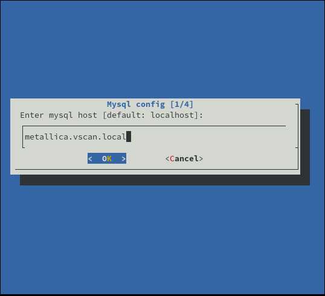
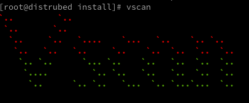

# Installation
Three types of installations are possible:

* rpm package.
* deb package.
* sources archive.

## RPM package

This procedure is the same for all distributions based on the RedHat environment.

First of all you have to install the EPEL repository:

```bash
dnf install -y epel-release
dnf install -y 'dnf-command(config-manager)'
dnf config-manager --set-enabled extras -y
dnf config-manager --set-enabled powertools
```

Installing the vscan repository server :

```bash
curl -s https://packagecloud.io/install/repositories/Drasrax/vscan/script.rpm.sh | sudo bash
```

Your version and your distribution will be detected by this script.

Install vscan:

Type the following command:

```bash
yum install vscan vscan-server
```

Install mariadb :

```bash
yum install mariadb-server
```

Launch mariadb service :

```bash
systemctl enable mariadb --now

systemctl start mariadb
```

Configure mariadb :

```bash
mysql_secure_installation
```

Connect as root to the database:

```
mysql -u root -p
```


Create database:

```
mysql> CREATE DATABASE vscan;
```


Create the vscan user and configure its password:

```
mysql> CREATE USER 'vscan'@'localhost' IDENTIFIED WITH mysql_native_password BY 'my-strong-password-here';
```


Give the rights on the database to the newly created user:

```
mysql> GRANT SELECT, INSERT, UPDATE, DELETE, CREATE, INDEX, DROP, ALTER, CREATE TEMPORARY TABLES, LOCK TABLES ON vscan.* TO 'vscan'@'localhost';
```

Import the vscan database:

```bash
mysql -u root -p << /opt/vscan/db/vscan.sql
```

#### Configure the database in vscan via the script :

```
vscan-config
```

You will have several steps of configuration, the first is to create the configuration file :


The second one asks you if you want to use a mysql database, the answer is yes:


Now the installer will ask you for the url of the database, in our case the database is remote if you install with a local database the hostname will be `localhost` :



We will now configure the user of the previously created database:


Then his password (the one given when the user was created):


Then we will configure the name of the database:


You will then get this message:


For security reasons it is strongly recommended to delete the directory `install` in `/opt/vscan` .

To do this, type the following command:


```
rm -rf /opt/vscan/install
rm -rf /opt/vscan/install
```


The vscan database is configured and ready to use !

#### Configure the database in vscan via the configuration file :

```bash
vi /etc/vscan_server/server.conf
```


#### Test vscan:

To test vscan type the following command:

```bash
vscan
```

 If successful, this is what you should see:




#### Configure CPE and CVE updates:

Vscan has its own task manager, the syntax is exactly the same as for a classic cron task:

```
# .---------------- minute (0 - 59)
# |  .------------- hour (0 - 23)
# |  |  .---------- day of month (1 - 31)
# |  |  |  .------- month (1 - 12) OR jan,feb,mar,apr ...
# |  |  |  |  .---- day of week (0 - 6) (Sunday=0 or 7) OR sun,mon,tue,wed,thu,fri,sat
# |  |  |  |  |
# *  *  *  *  *  
```


You are therefore free to choose the frequency with which they are updated, however the recommendations for the updates of the CPE is this one:

```
CPE_CHECK = 00 3 * * *
```

This means every day at 3am. This is the frequency at which the definitions are updated by NVD.


For the CVE :

```
CVE_CHECK = * */4 * * *
```


That is to say, every 4 hours, this time can be reduced if necessary to reduce the detection time of a possible vulnerability.


#### Launch the service :

To start the service, simply run the following `systemctl` command:

```
systemctl start vscan
```


To know the status of the service :

```
[root@trivium ~]# systemctl status vscan
● vscan.service - Routines task of vscan used for the cve and cpe update
   Loaded: loaded (/etc/systemd/system/vscan.service; enabled; vendor preset: disabled)
   Active: active (running) since Sun
 2021-01-10 22:38:43 UTC; 3s ago
 Main PID: 9948 (python3)
    Tasks: 12 (limit: 26213)
   Memory: 30.8M
   CGroup: /system.slice/vscan.service
           ├─9948 python3 /opt/vscan/service.py
           ├─9950 python3 /opt/vscan/service.py
           ├─9951 python3 /opt/vscan/service.py
           ├─9952 python3 /opt/vscan/service.py
           ├─9953 python3 /opt/vscan/service.py
           ├─9954 python3 /opt/vscan/service.py
           └─9955 python3 /opt/vscan/service.py

janv. 10 22:38:43 trivium systemd[1]: Started Ro
utines task of vscan used for the cve and cpe up
date.
janv. 10 22:38:43 trivium service.py[9948]: 1687
7.0
janv. 10 22:38:43 trivium service.py[9948]: 2107
7.0

```

### Configure the API (optional)

Open the following file `/etc/vscan/server.conf`.

```bash
vi /etc/vscan/server.conf
```

At the end of the file you will find the `API` section.

Complete it with your information.

```
[API]
ADDRESS =
PORT = 5000
```

Note that the port will be used by the Dashboard if it is installed on this or another machine.

### Start the API service

To start the service, simply run the following `systemctl` command:

```
systemctl start vscan-api
```


To know the status of the service :

```
[root@trivium ~]# systemctl status vscan-api
● vscan-api.service - API server of vscan
   Loaded: loaded (/etc/systemd/system/vscan-api.service; enabled; vendor prese>
   Active: active (running) since Thu 2021-05-20 22:00:23 UTC; 4 days ago
 Main PID: 166 (python3)
    Tasks: 1 (limit: 26213)
   Memory: 21.1M
   CGroup: /system.slice/vscan-api.service
           └─166 python3 /opt/vscan/api/init.py
```
