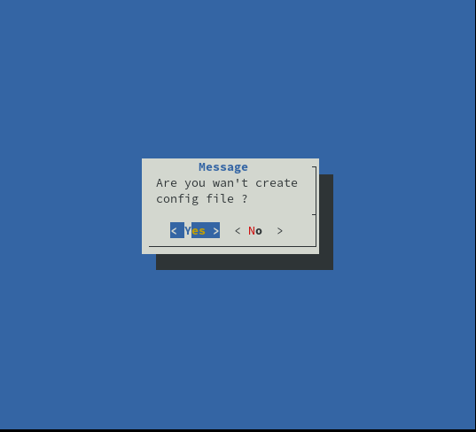
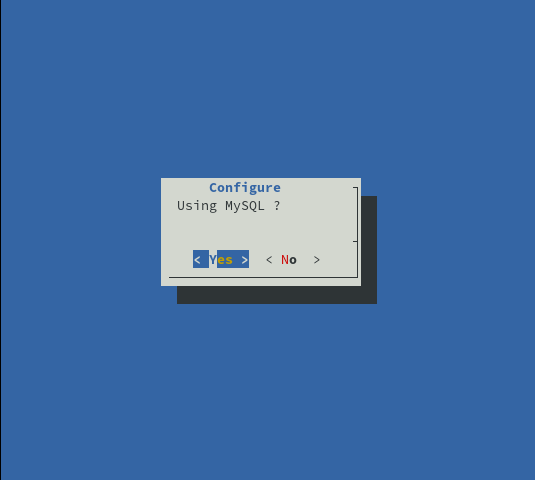
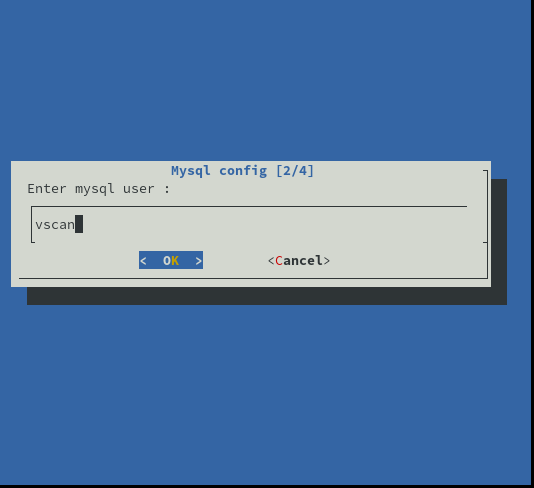
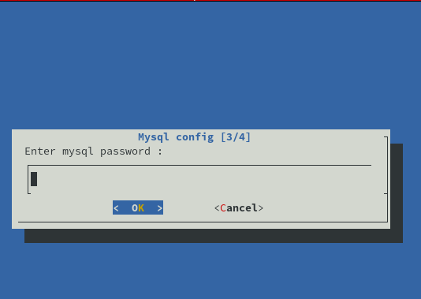
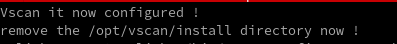

# Installation
Trois types d'installations sont possibles : 

* Via les paquets rpm.
* Via les paquets deb.
* Via les sources

## Via les paquets rpms

Cette procédure est la même pour toutes les distributions basées sur l'environnement RedHat.

En tout premier lieux il vous faut installer le repository EPEL :

```bash 
dnf install -y epel-release
dnf install -y 'dnf-command(config-manager)'
dnf config-manager --set-enabled extras -y
dnf config-manager --set-enabled powertools
```

Installer le serveur de dépôts de vscan :

```bash 
curl -s https://packagecloud.io/install/repositories/Drasrax/vscan/script.rpm.sh | sudo bash
```

Votre version ainsi que votre distribution seront détectées par ce script.

Installer vscan: 

Tapez la commande suivante : 

```bash 
yum install vscan vscan-server
```

Installer mariadb : 

```bash 
yum install mariadb-server 
```

Démarrer le service mariadb : 

```bash 
systemctl enable mariadb --now

systemctl start mariadb
```

Configurer mariadb : 

```bash
mysql_secure_installation
```

Se connecter en root a la base de donnée : 

```
mysql -u root -p
```


Créer la base de donnée : 

```
mysql> CREATE DATABASE vscan;
```


Créer l'utilisateur vscan et configuré son mot de passe : 

```
mysql> CREATE USER 'vscan'@'localhost' IDENTIFIED WITH mysql_native_password BY 'my-strong-password-here';
```


Donner les droits sur la base de donnée a l'utilisateur fraichement créer : 

```
mysql> GRANT SELECT, INSERT, UPDATE, DELETE, CREATE, INDEX, DROP, ALTER, CREATE TEMPORARY TABLES, LOCK TABLES ON vscan.* TO 'vscan'@'localhost';
```

Importer la base de données de vscan: 

```bash
mysql -u root -p << /opt/vscan/db/vscan.sql
```

#### Configurer la base de données dans vscan via le script : 

```
vscan-config
```

Vous aurez ainsi plusieurs étapes de configuration, la première est de créer le fichier de configuration :



La seconde vous demande si vous souhaitez utiliser une base de donnée mysql, la réponse est oui : 



Maintenant l'installeur va vous demander l'url de la base de donnée, dans notre cas la base de données est distante si vous effectuez une installation avec base de donnée locale le nom d'hôte sera `localhost` :


Nous allons maintenant configuré l'utilisateur de la base de donnée précédement créer : 



Puis son mot de passe (celui renseigné lors de la création de l'utilisateur): 



Puis nous allons configuré le nom de la base de donnée : 


Vous aurez ensuite ce message : 



Pour des questions de sécurité il est fortement recomandé de supprimer  le repertoire `install` dans `/opt/vscan` . 

Pour ce faire tapez la commande suivante : 

```
rm -rf /opt/vscan/install
rm -rf /opt/vscan/install
```


La base de donnée de vscan est configurée et prête a être utilisée ! 

#### Configurer la base de données dans vscan via le fichier de configuration : 

```bash 
vi /etc/vscan_server/server.conf
```


#### Tester vscan: 

Pour tester vscan tapez la commande suivante : 

```bash
vscan
```

 En cas de succès voici ce que vous devriez voir : 


#### Configurer les mises à jour des CPE et des CVE : 

Vscan dispose de son propre gestionnaire de taches, la syntaxe est exactement la même que pour une tach cron classique : 

```
# .---------------- minute (0 - 59)
# |  .------------- hour (0 - 23)
# |  |  .---------- day of month (1 - 31)
# |  |  |  .------- month (1 - 12) OR jan,feb,mar,apr ...
# |  |  |  |  .---- day of week (0 - 6) (Sunday=0 or 7) OR sun,mon,tue,wed,thu,fri,sat
# |  |  |  |  |
# *  *  *  *  *  
```


Vous êtes donc libre de la fréquence a laquelles celles-ci sont mises à jour, cependant les recommandations pour les mises à jours des CPE est celle-ci : 

```
CPE_CHECK = 00 3 * * *
```

C'est à dire tous les jours à 3 h du matin. Ceci est la fréquence a laquelle les définitions sont mises à jour par NVD.


Et pour les CVE : 

```
CVE_CHECK = * */4 * * *
```


C'est à dire toutes les 4 heures, ce temps peut être réduit au besoin afin de diminuer le temps de detection d'une possible faille.


#### Démarrer le service : 

pour démarrer le service il vous suffit de lancer la commande `systemctl` suivante : 

```
systemctl start vscan
```


Pour connaître le status du service : 

```
[root@trivium ~]# systemctl status vscan
● vscan.service - Routines task of vscan used for the cve and cpe update
   Loaded: loaded (/etc/systemd/system/vscan.service; enabled; vendor preset: disabled)
   Active: active (running) since Sun
 2021-01-10 22:38:43 UTC; 3s ago
 Main PID: 9948 (python3)
    Tasks: 12 (limit: 26213)
   Memory: 30.8M
   CGroup: /system.slice/vscan.service
           ├─9948 python3 /opt/vscan/service.py
           ├─9950 python3 /opt/vscan/service.py
           ├─9951 python3 /opt/vscan/service.py
           ├─9952 python3 /opt/vscan/service.py
           ├─9953 python3 /opt/vscan/service.py
           ├─9954 python3 /opt/vscan/service.py
           └─9955 python3 /opt/vscan/service.py

janv. 10 22:38:43 trivium systemd[1]: Started Ro
utines task of vscan used for the cve and cpe up
date.
janv. 10 22:38:43 trivium service.py[9948]: 1687
7.0
janv. 10 22:38:43 trivium service.py[9948]: 2107
7.0

```

